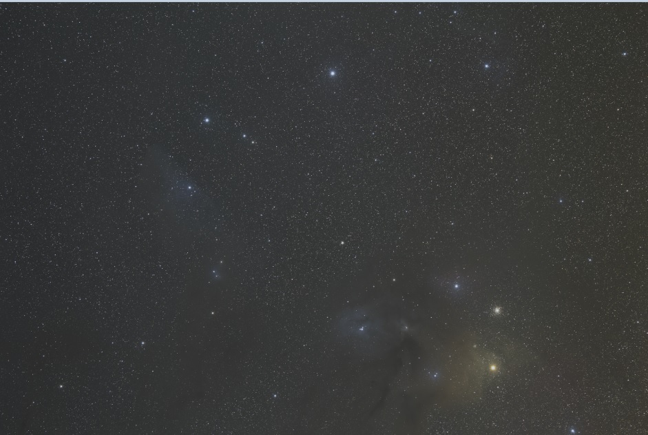
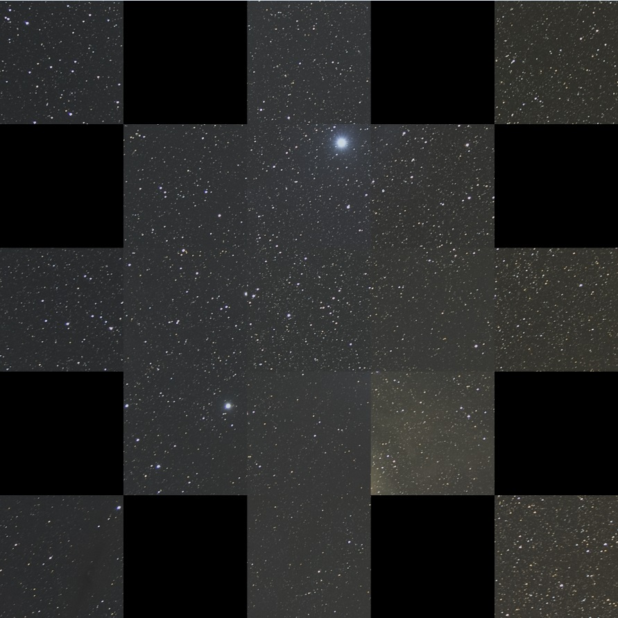

# corner_maker
よしなに画像の隅を切り出します．
Suitably cut out the corners of images(mainly used for astrophotos).

## Input and Output
16-bit tiff only.

## Usage
```
$ corner_maker [input_file_name] [config_file_name]
```

## How to Compile?
I've used Visual Studio 2017 C++ Compiler on Windows and OpenCV 3.4.1.
If you work on the similar environment, please open .sln file, and try to suit the OpenCV's dependencies to your system.  
If not, please refer to [corner_maker.cpp](corner_maker/corner_maker.cpp) and compile it on your own environments(the first line of include(stdafx.h) might had better to be deleted).

## Example
input


output


## Requirements
* [config file] 
```
135       // focal length(not give special means, program will run regardless of this number.)
300       // pixel size, which represents the size of each squares
full-size // full-size or apsc
1 0 1 0 1 // which part is drawn? 
0 1 1 1 0 // 1 -> drawed / 0 -> not drawed
1 1 1 1 1
0 1 1 1 0
1 0 1 0 1
```

## TODO
